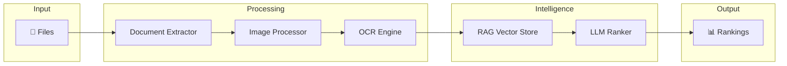

# AuraAI - AI-Powered Resume Ranking Service

AI-powered resume analysis that ranks candidates using **semantic analysis** and differentiates between **demonstrated skills** (proven experience) and **mentioned skills** (just listed).

---

## ✨ Features

- 📤 **Multi-Format Upload** - ZIP, PDF, DOCX, or images (PNG/JPG/TIFF)
- 🖼️ **OpenCV Preprocessing** - Denoise, deskew, enhance scanned images
- 📝 **Smart OCR** - Tesseract for images, direct parsing for DOCX
- 🤖 **LLM Ranking** - Ollama (llama3) for intelligent skill analysis
- ⚖️ **Skill Differentiation** - Weighted scoring for demonstrated vs mentioned skills

---

## 🚀 Quick Start

### Prerequisites

```powershell
# 1. Install Ollama and models
ollama pull llama3
ollama pull nomic-embed-text

# 2. Install Tesseract OCR
# Download from: https://github.com/UB-Mannheim/tesseract/wiki

# 3. Install Poppler (for PDF support)
# Download from: https://github.com/oschwartz10612/poppler-windows/releases
```

### Installation

```powershell
pip install -r requirements.txt
```

### Run

```powershell
uvicorn main:app --reload
```

Access at **http://localhost:8000**

---

## 🏗️ Architecture

### High-Level Overview



### Processing Flow

1. **Upload**: User uploads resumes (ZIP, PDF, DOCX, images)
2. **Extract**: Documents are extracted and preprocessed
3. **OCR**: Text extracted via Tesseract or direct parsing
4. **Embed**: Text converted to vectors and stored
5. **Analyze**: LLM analyzes each resume against job description
6. **Rank**: Candidates scored and ranked

---

## 🔧 Components

### Document Extractor
Handles multiple file formats with parallel processing (4 workers).

| Format | Method | Tool |
|--------|--------|------|
| PDF | Images → OCR | Poppler + Tesseract |
| DOCX | Direct parse | python-docx |
| Images | Preprocess → OCR | OpenCV + Tesseract |

### Image Processor
OpenCV pipeline for scanned documents:
```
Image → Grayscale → Denoise → Deskew → Enhance → Threshold → OCR-Ready
```

### RAG Service
Vector storage using embeddings:
- **Chunk size**: 1000 characters
- **Model**: nomic-embed-text
- **Search**: Cosine similarity

### LLM Ranker
Two-stage analysis:
1. **Extract skills** from job description
2. **Analyze resumes** - identify demonstrated vs mentioned skills

---

## ⚖️ Scoring Algorithm

### Formula
```
Score = (Demonstrated × 2.0) + (Mentioned × 0.5) + (Experience × 0.3)
        ─────────────────────────────────────────────────────────────
                            Maximum Possible Score
```

### Weights

| Type | Weight | Why |
|------|--------|-----|
| **Demonstrated** | 2.0x | Proven with evidence |
| **Mentioned** | 0.5x | Listed but unproven |
| **Experience** | 0.3x | Years bonus |

### Example
```
Job: Python, FastAPI, Docker, AWS (4 skills)
Candidate: Demonstrated Python, FastAPI | Mentioned Docker | Missing AWS | 3 years

Score = (2×2.0) + (1×0.5) + (3×0.3) = 5.4
Max   = (4×2.0) + (3×0.3) = 8.9
Final = 5.4 / 8.9 = 60.7%
```

---

## 📡 API Endpoints

| Endpoint | Method | Description |
|----------|--------|-------------|
| `/` | GET | Frontend UI |
| `/api/health` | GET | Health check |
| `/upload-resumes` | POST | Upload files |
| `/rank-candidates` | POST | Rank against JD |
| `/candidates/{id}` | GET | List candidates |
| `/session/{id}` | DELETE | Delete session |

---

## 🛠️ Tech Stack

| Component | Technology |
|-----------|------------|
| API | FastAPI |
| OCR | Tesseract 5.5.0 |
| PDF | Poppler |
| Image | OpenCV |
| LLM | Ollama + llama3 |
| Embeddings | nomic-embed-text |
| Frontend | HTML/CSS/JS |

---

## 📁 Project Structure

```
AuraAi/
├── main.py                    # API endpoints
├── config.py                  # Settings
├── requirements.txt           # Dependencies
│
├── frontend/
│   ├── index.html             # UI structure
│   ├── styles.css             # Dark theme
│   └── app.js                 # Client logic
│
├── models/
│   └── schemas.py             # Pydantic models
│
├── services/
│   ├── document_extractor.py  # File processing
│   ├── image_processor.py     # OpenCV pipeline
│   ├── rag_service.py         # Vector store
│   └── llm_ranker.py          # LLM scoring
│
├── uploads/                   # Temp storage
└── chroma_db/                 # Persistence
```

---

## ⚡ Performance

| Optimization | Impact |
|--------------|--------|
| Parallel processing (4 workers) | 4x faster |
| Reduced DPI (150) | 2x faster PDF |
| In-memory search | Sub-ms queries |

---

## 🔒 Security

- Filename sanitization
- Path traversal prevention
- Extension whitelist
- 50MB upload limit

---

## 📚 API Documentation

- Swagger UI: http://localhost:8000/docs
- ReDoc: http://localhost:8000/redoc
