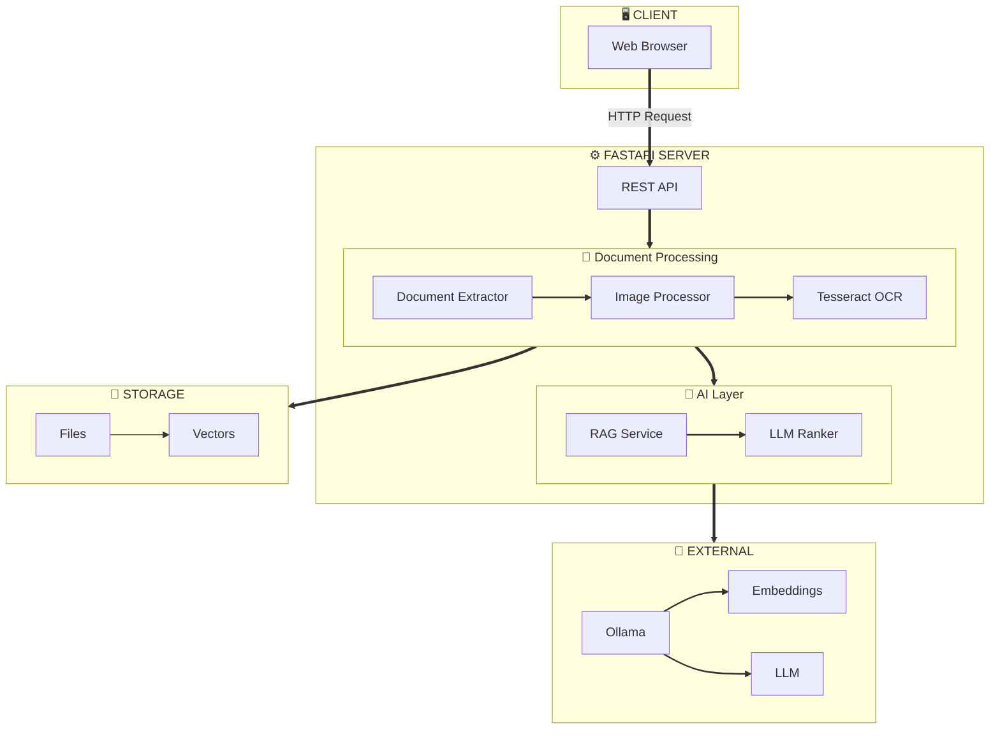
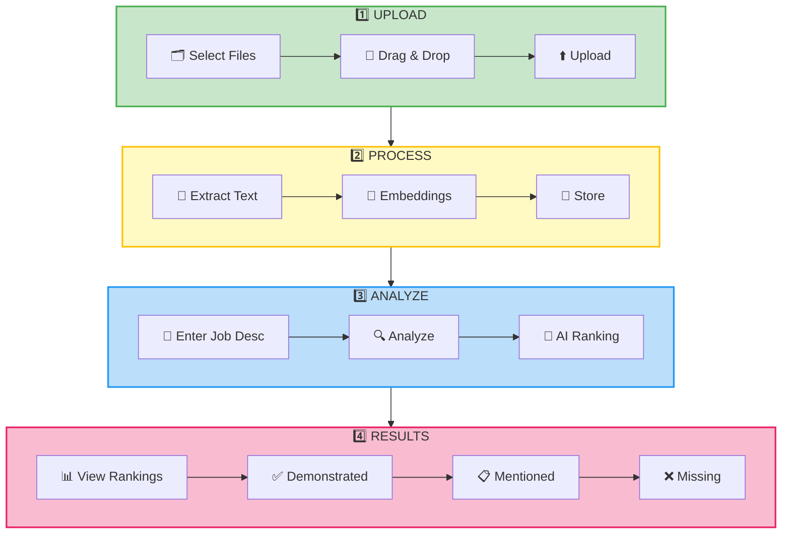
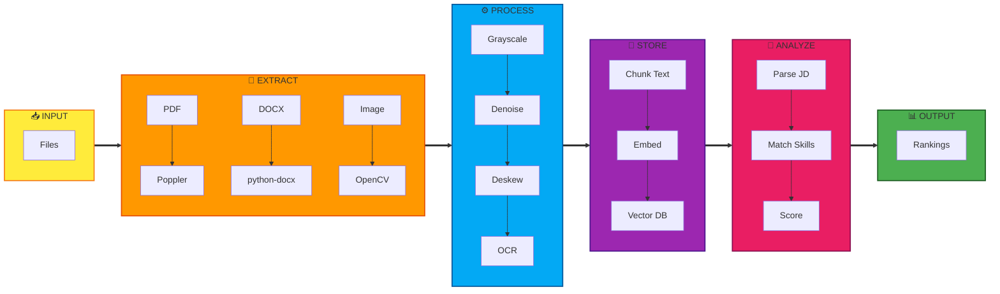
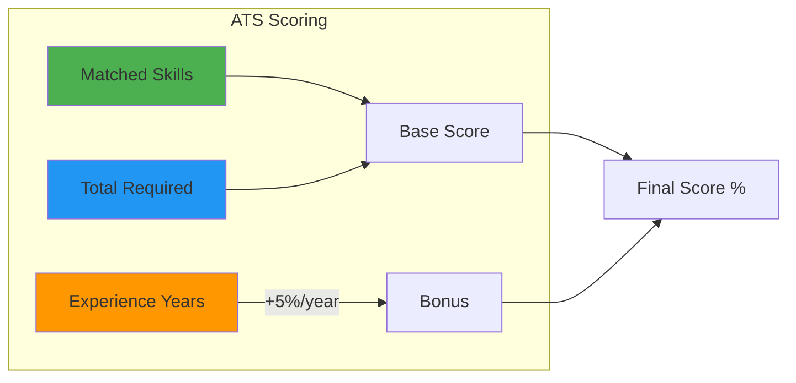

# AuraAI - AI-Powered Resume Ranking Service

AI-powered resume analysis that ranks candidates using **semantic analysis** and differentiates between **demonstrated skills** (proven experience) and **mentioned skills** (just listed).

---

## ✨ Features

- 📤 **Multi-Format Upload** - ZIP, PDF, DOCX, or images (PNG/JPG/TIFF)
- 🖼️ **OpenCV Preprocessing** - Denoise, deskew, enhance scanned images
- 📝 **Smart OCR** - Tesseract for images, direct parsing for DOCX
- 🤖 **LLM Ranking** - Ollama (llama3) for intelligent skill analysis
- ⚖️ **Skill Differentiation** - Weighted scoring for demonstrated vs mentioned skills

---

## 🏗️ System Architecture



---

## 👤 User Flow



---

## 🔄 Data Pipeline



### Pipeline Stages

| Stage | Components | Output |
|-------|------------|--------|
| **Extract** | Poppler, python-docx, OpenCV | Raw content |
| **Process** | Grayscale → Denoise → Deskew → OCR | Clean text |
| **Store** | Chunking → Embeddings → Vector DB | Searchable vectors |
| **Analyze** | JD Parsing → Skill Matching → Scoring | Match scores |

---

## ⚖️ Scoring Algorithm (Industry Standard ATS)



### Formula
```
Score = (Matched Skills / Total Required Skills) × 100 + Experience Bonus
```

| Factor | Weight | Description |
|--------|--------|-------------|
| **Required Skills** | 1.0x | Must-have skills from JD |
| **Preferred Skills** | 0.5x | Nice-to-have skills |
| **Experience Bonus** | +5%/year | Max 15% bonus |

### Why This Formula?
- **Industry Standard**: Used by major ATS systems (Taleo, Workday, Greenhouse)
- **Fair & Objective**: No distinction between "demonstrated" vs "mentioned" (both can be fabricated)
- **Keyword-Based**: Matches how real ATS systems work

---

## 🚀 Quick Start

```powershell
# Prerequisites
ollama pull llama3
ollama pull nomic-embed-text

# Install
pip install -r requirements.txt

# Run
uvicorn main:app --reload
```

Access at **http://localhost:8000**

---

## 📡 API Endpoints

| Endpoint | Method | Description |
|----------|--------|-------------|
| `/` | GET | Frontend UI |
| `/upload-resumes` | POST | Upload files |
| `/rank-candidates` | POST | Rank against JD |
| `/candidates/{id}` | GET | List candidates |

---

## 🛠️ Tech Stack

| Component | Technology |
|-----------|------------|
| API | FastAPI |
| OCR | Tesseract |
| PDF | Poppler |
| Image | OpenCV |
| LLM | Ollama + llama3 |
| Embeddings | nomic-embed-text |

---

## 📁 Project Structure

```
AuraAi/
├── main.py              # API endpoints
├── config.py            # Settings
├── frontend/            # Web UI (HTML/CSS/JS)
├── models/schemas.py    # Pydantic models
└── services/
    ├── document_extractor.py
    ├── image_processor.py
    ├── rag_service.py
    └── llm_ranker.py
```

---

## 📚 Documentation

- **Swagger**: http://localhost:8000/docs
- **ReDoc**: http://localhost:8000/redoc
